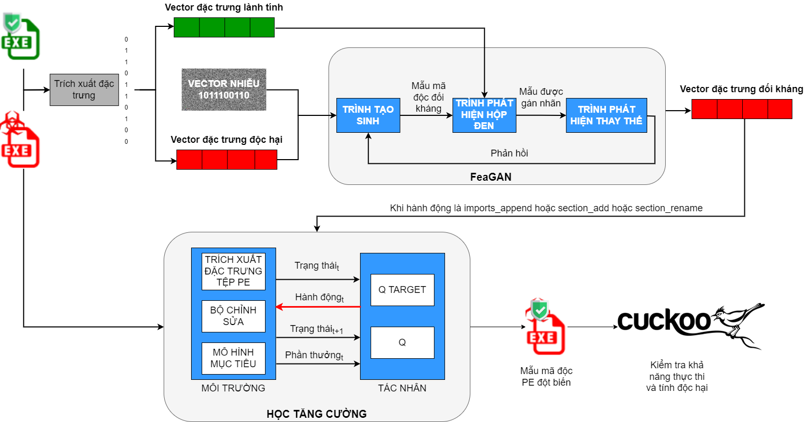

> # Khóa luận được thực hiện dựa trên mã nguồn [gốc](https://github.com/CyberForce/Pesidious)

# Nghiên cứu phương pháp phát sinh mẫu mã độc đối kháng chống lại trình phát hiện mã độc tổng hợp

## Kiến trúc tổng quan


## Các phần mềm yêu cầu
1. [Cài đặt Python 3.6]((https://realpython.com/installing-python/))

1. Clone repo này
    ```sh
    git clone https://github.com/danhlk/NT505.git
    ```
1. Di chuyển vào thư mục
    ```sh
    cd NT505
    ```

1. Yêu cầu phiên bản pip==8.1.1
    ```sh
    pip install pip==8.1.
    ```

1. [Cài đặt môi trường ảo](https://docs.python.org/3/tutorial/venv.html)
    > Khuyến khích sử dụng môi trường ảo cho từng file requirements bên dưới để tránh xung đột với môi trường thật của host.

1. Cài các thư viện yêu cầu
    ```sh
    pip install -r pip_requirements/requirements.txt
    ```

## Bắt đầu triển khai

### Tạo mẫu vector đối kháng
1. Trích xuất đặc trưng cho FeaGAN<br>
    Đảm bảo các mẫu đã được phân loại và đặt trong thư mục Data/benign và Data/malware 
    ```sh
    python extract_features.py -l debug
    ```

1. Huấn luyện FeaGAN
    ```sh
    python main_malgan.py -l debug --detecttor <tên thuật toán cho blackbox>
    ```
    Đầu ra là các vector đối kháng, nhưng chỉ là các số 0 và 1.
1. Ánh xạ lại thông tin thật
    ```sh
    python binary_builder.py -m <đường dẫn đến mẫu bất kỳ> -a <đường dẫn đến file vector đối kháng muốn lấy lại thông tin> -l debug
    ```

### Tạo đột biến bằng Học tăng cường
1. Trích xuất tính năng cho Mô hình mục tiêu<br>
    Dữ liệu được chia sẵn trong thư mục independent
    ```sh
    python extract_gym.py
    ```

1. Huấn luyện và đánh giá Mô hình mục tiêu<br>
    Sửa code ở bên trong để chọn thuật toán cần huấn luyện
    ```sh
    python train_independent.py
    ```

1. Phân loại mẫu gốc<br>
    Trong khóa luận đặt mẫu gốc trong thư mục independent/malware/mutate/
    ```sh
    python classifier.py -d <đường dẫn đến mẫu gốc>
    ```

1. Huấn luyện tác nhân<br>
    Sử dụng các mẫu trong thư mục Data/malware để học
    ```sh
    python rl_train.py -l debug --imports <đường dẫn đến file import đối kháng> --sections <đường dẫn đến file section đối kháng> --classifier <thuật toán cần bypass> 
    ```
1. Tạo mẫu đột biến
    ```sh
    python mutate.py --saved_model <file model đã train ở trên> --imports <như trên> --sections <như trên> -d <thư mục chứa các mẫu cần đột biến> -o <thư mục chứa mẫu đã đột biến>
    ```

1. Kiểm tra lại kết quả phân loại
    ```sh
    python classifier.py -d <đường dẫn chứa mẫu đột biến>
    ```

### Kiểm tra mẫu trên Cuckoo Sandbox và VirusTotal
1. [Cài đặt Cuckoo Sandbox](https://cuckoo.readthedocs.io/en/latest/installation/)

1. Gửi mẫu lên VirusTotal và nhận kết quả<br>
    Cài đặt thư viện [VirutsTotal]()
    ```sh
    python scan_file.py <tên file kết quả> <dòng API trong api.txt> <chỉ số bắt đầu> <chỉ số kết thúc>
    ```
    Kết quả được lưu vào file csv, phân cách bằng dấu ','

1. Đưa mẫu vào Cuckoo Sandbox<br>
    Chỉnh sửa thông tin trong file trước khi chạy
    ```sh
    python automate.py
    ```

1. Lưu kết quả vào CSV để so sánh<br>
    ```sh
    python read_json_cuckoo.py
    ```
